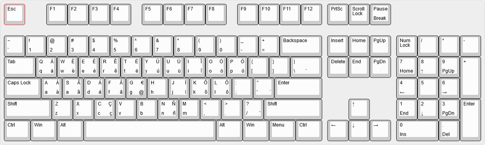
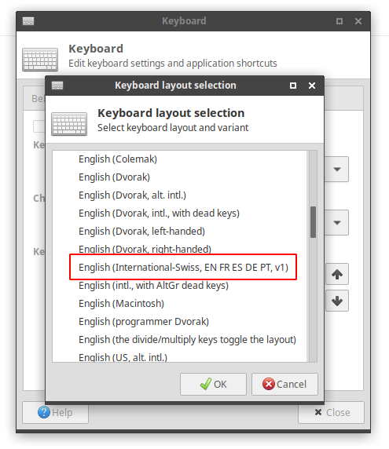

# US International Swiss Latin Keyboard Layout

# About

As a developer, I like the US keyboard layout because many of the special characters needed for coding (such as `{ } [ ] < >`) are easily available without having to use a modifier.

As a mechanical keyboard user, don't have much of a choice, especially given that my "native" keyboard layout is Swiss, for which almost no mechanical keyboard or nice keyset is made.

As someone who writes in a number of languages daily (I'm from Switzerland, I live in Brazil, I work for a German company...), I need to be able to type accentuated characters for several languages: French, German, Portuguese, Spanish.

The problem with the US layout is that it is impossible to write those accentuated characters.

There exist some international variations of the US layout. The problem is that they are not geared towards a specific language, attempt to provide as much variety as possible and end up unusable for real typing. Also, there is no cross-platform US-International layout, i.e. there is no layout that looks the exactly the same in Windows, Linux and MacOS.

So, I decided to make my own layout, taylor-suited to my own needs, that is :

- Based on the US layout: everything that is printed on the keys of a normal US keyboard stays is still valid (avoids problem sharing your keyboard or laptop!)
- Easy and intuitive typing of accentuated characters for the following languages (more or less in that oreder of priority):
 - French
 - German
 - Portuguese
 - Spanish
- Minimal use of dead keys, and dead keys do not interfer with normal use (dead keys are triggered only with modifier)
- No dead keys for frequently used characters in the aforementioned languages

This is the result. Given the languages supported and my nationality, I came up with the (very original) name US-International-Swiss-Latin.

This layout is available for Linux and Windows. An older version of a similar layout is available for mac in my other [https://github.com/HereThereBeMonsters/MacKeyboardLayout](Mac keyboard repository) but not supported any more. I don't plan to support Mac in the near future since I don't own or use a Mac any more.

I am probably not the only one on this planet with similar needs. There are probably _dozens of us_! So if you think it will be useful to you, enjoy it. I welcome any feedback!

What it is not: This is not an ergonomical layout, it's not supposed to make your fingers travel less on the keyboard or to make you a faster typist. It builds upon a familiar layout and only adds capabilities.

# Layout

Here is a picture of the layout (made with http://www.keyboard-layout-editor.com, the source JSON file is in the root of the repo and it is stored in this [gist](http://www.keyboard-layout-editor.com/#/gists/b3b26762c7a3d9ad980f1c7f561b26d8) :



In this picture, the character at the bootom left of the key is the one produced without any modifier. The one on the upper left is the one produced with `[shift]`. The one on the bottom right is the one with `[alt-gr]` (the right `[alt]` key) and the one on the upper-right is the one with `[shift] + [alt-gr]`.

## Basic principles

As you can see, without using the [alt-gr key] the layout is the 
The basic idea for the layout is the following: use the `[alt-gr]` key (the right `[alt]` key) in combination for the basic letter to create the most used accentuated version of it. For example

`[alt-gr] + [e] -> é`
`[alt-gr] + [o] -> ö`
`[alt-gr] + [n] -> ñ`
`[alt-gr] + [c] -> ç`

Then, for vowels that have many possible accented variants, use the neighboring keys for other frequently used combinations, e.g:

`[alt-gr] + [w] -> è`
`[alt-gr] + [r] -> ê`

and so on...

The `[alt-gr]` + vowel combinations also works with upper case letters, so:

`[alt-gr] + [shift] + [e] -> É`
`[alt-gr] + [shift] + [o] -> Ö`
etc.

Finally, I also added the conbination [alt-gr] + [g] -> @ just because I got used to it from the Mac keyboard and find it nice to have the at sign somewhere in the middle of the keyboard, and the euro € sign on the same key with the shift modifier.

## Dead keys

In addition to the characters typed directly with [alt-gr] + letter, there are also 5 dead keys that can be used to type rarely used accentuated characters.

First the `[``~]` key is a bit special. Used without the `[alt-gr]` modifer it just types the `` and ~ characters, which is useful for coding.

With the `[alt-gr]` modifier, it turns into a dead key for the tilde and grave accents, so:

`[alt-gr] + [``~] then [a] -> à`
`[alt-gr] + [shift] + [``~] then [a] -> ã`

Then, `[alt-gr] + ['"]` is a dead key for ¨ (umlaut):

`[alt-gr] + ['"] then [a] -> ä`

`[alt-gr] + [ \ ]` is a dead key for `(grave accent)

`[alt-gr] + [/]` is a dead key for ´ (acute accent)

In Windows, except for the tilde, those dead keys all work for the letters A, E, I, O, and U, lower and upper case.

In Linux, XKB manages the combination of dead keys and letters, so the support should be even wider.

# How to install

## Windows

The layout was made using Microsoft Keyboard Layout Creator (KLC), that can be downloaed [here](https://www.microsoft.com/en-us/download/confirmation.aspx?id=22339).

It required the .Net framework version 2.0 that can be downloaded [here](https://www.microsoft.com/en-us/download/details.aspx?id=16614).

In order to modify the keyboard, just open the `*.klc` file in KLC.

The binaries are provided in the `windows/build` folder as ZIP archives. To install the layout, download the relevant ZIP file, decompress it and run the setup.exe file, which will add the lazout to zour windows installation. Then you have to add the layout to your user profile. This has become a little convoluted in Windows 10, but Google will help you find a HowTo for that. The name of the layout that will appear in the windows dialog is US-Int-Swiss-Lat-v1.

## Linux

The Linux version has an interesting addition: the `caps_lock` key can be used, in addition to the `alt_gr` key, in order to access the alternative characters.

Note: These instructions are valid and were tested on Ubuntu 18.10. For other versions and distributions, the paths of the files might be different.

To install the layout on Linux:

- Clone this repository
- `cd` into the linux subdirectory
- execute the install script (needs admin rights): `sudo ./install-ubuntu.sh add` It will add the definition of the layout in the existing US layout definition file `/usr/share/X11/xkb/symbols/us`. (Before touching the file it creates a backup copy of it in the same directory)
- Update the rules XML file:
    - copy the XML fragment displayed in the console (or copy it from the `rule.xml` file)
    - open the file `/usr/share/X11/xkb/rules/evdev.xml` in a text editor (using sudo so you can then save it)
    - find the element that defines the US layout, it should look like something like that:
    ```<layout>
      <configItem>
        <name>us</name>
        
        <shortDescription>en</shortDescription>
        <description>English (US)</description>
        <languageList>
          <iso639Id>eng</iso639Id>
        </languageList>
      </configItem>
      <variantList>
       ...
      </variantList> 
    ```
    - Paste the XML fragment into the `<variants>` element  
- At this point, the layout should appear as a variant of the US layout in your desktop environment's keyboard configuration UI, for example in XFCE: 



